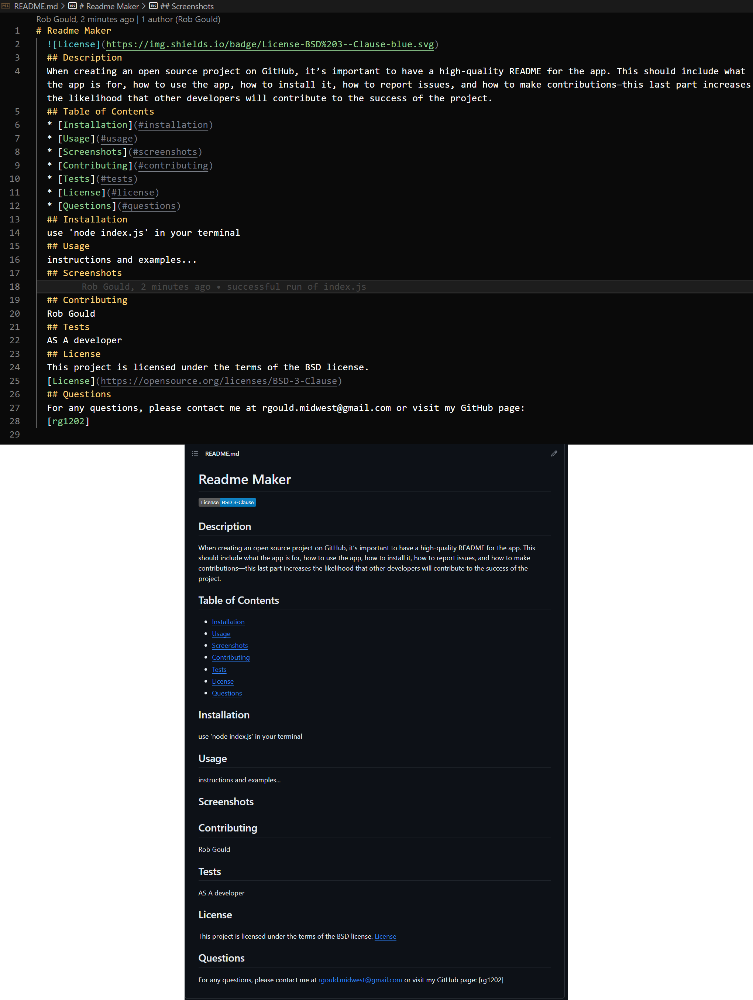

# Readme Maker
  
  ## Description
  Description
  ## Table of Contents
  * [Installation](#installation)
  * [Usage](#usage)
  * [Screenshots](#screenshots)
  * [Contributing](#contributing)
  * [Tests](#tests)
  * [License](#license)
  * [Questions](#questions)
  ## Installation
  Install steps
  ## Usage
  instructions
  ## Screenshots
  
  ## Contributing
  Rob
  ## Tests
  User Story AC
  ## License
  This project is licensed under the terms of the GPL license.
  [License: GPL v3](https://www.gnu.org/licenses/gpl-3.0)
  ## Questions
  For any questions, please contact me at rgould.midwest@gmail.com or visit my GitHub page:
  [https://github.com/rg1202] 
